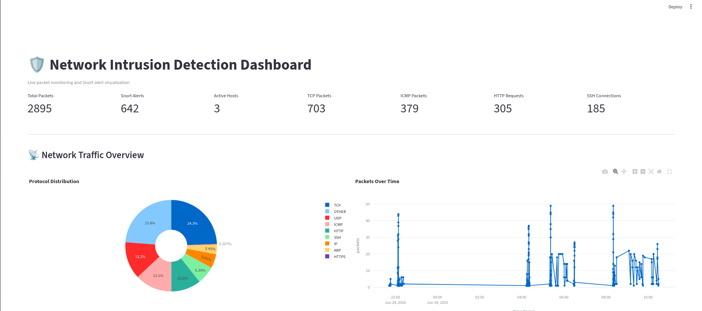
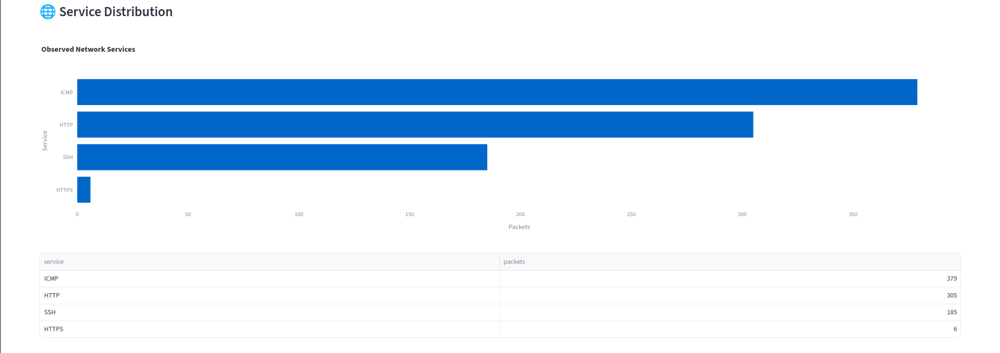
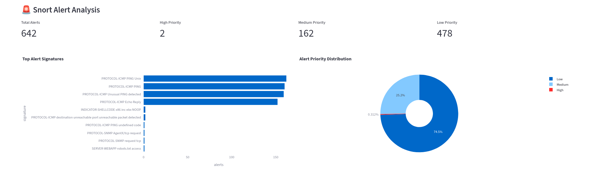
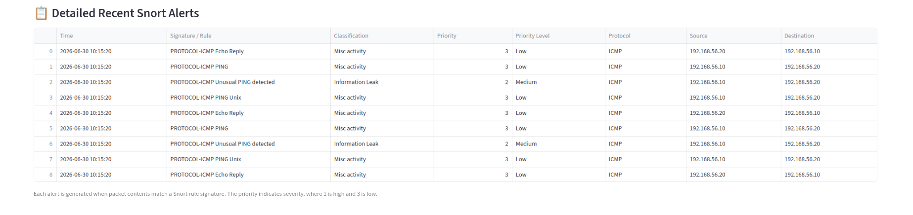

# 🛡️ Real-Time Network Intrusion Detection System Dashboard

A real-time Network Intrusion Detection System (NIDS) built using **Snort 3**, **Scapy**, **SQLite**, and **Streamlit**. The system captures live network traffic, detects malicious activity using signature-based detection, and visualizes both network traffic and security alerts through an interactive web dashboard.

---

## Features

- Real-time network traffic monitoring
- Signature-based intrusion detection using Snort 3
- Live packet capture using Scapy
- Interactive Streamlit dashboard
- Automatic dashboard refresh
- Protocol and service distribution
- Snort alert visualization
- Alert severity monitoring
- Suspicious source IP detection
- HTTP, SSH, ICMP and DNS traffic monitoring
- SQLite backend for efficient storage
- Automatic Snort log rotation using `logrotate`

---

# System Architecture

```
                     Host-Only Network
                     (192.168.56.0/24)

           Kali VM                     Ubuntu Victim VM
      (Traffic Generator)             (Target Services)
                │                              │
                └──────────────┬───────────────┘
                               │
                               ▼
                        Ubuntu Snort VM
                ┌──────────────────────────────┐
                │         Snort 3 IDS          │
                │                              │
                │ Live Packet Collector        │
                │ Live Alert Collector         │
                │ SQLite Database              │
                │ Streamlit Dashboard          │
                └──────────────────────────────┘
```

---

# Working Pipeline

```
                    Network Traffic
                           │
                           ▼
                 Monitoring Interface
                        (enp0s8)
                           │
          ┌────────────────┴────────────────┐
          │                                 │
          ▼                                 ▼
     Scapy Collector                  Snort 3 IDS
          │                                 │
          ▼                                 ▼
 SQLite (Latest 5000 Packets)      snort_alerts.txt
                                            │
                                      logrotate
                                            │
                                            ▼
                                 Live Alert Collector
                                            │
                                            ▼
                                SQLite (Latest 1000 Alerts)
                                            │
                                            ▼
                                   Streamlit Dashboard
```

---

# Repository Structure

```
Real-Time-Network-IDS-Dashboard/

├── README.md
├── LICENSE
├── requirements.txt
├── .gitignore
│
├── src/
│   ├── dashboard.py
│   ├── init_db.py
│   ├── live_packet_collector.py
│   └── live_alert_collector.py
│
├── screenshots/
│   ├── dashboard.png
│   ├── alerts.png
│   ├── services.png
│   └── ...
```

---

# Technologies Used

| Component | Technology |
|------------|------------|
| IDS | Snort 3 |
| Packet Capture | Scapy |
| Dashboard | Streamlit |
| Visualization | Plotly |
| Database | SQLite |
| Programming Language | Python |
| Operating System | Ubuntu 24.04 |
| Attacker Machine | Kali Linux |
| Virtualization | Oracle VirtualBox |

---

# Network Configuration

| Machine | Role | IP |
|----------|------|----|
| Kali Linux | Attacker | 192.168.56.10 |
| Ubuntu Victim | Victim | 192.168.56.20 |
| Ubuntu Snort | IDS | 192.168.56.30 |

---

# Dashboard Overview

The dashboard provides real-time visualization of:

- Total Packets
- Snort Alerts
- Active Hosts
- HTTP Requests
- SSH Connections
- ICMP Packets
- Protocol Distribution
- Service Distribution
- Top Source IPs
- Suspicious Source IPs
- Alert Severity Distribution
- Top Alert Signatures
- Detailed Snort Alert Table

---

# Installation

## Clone Repository

```bash
git clone https://github.com/MaheenN31/Real-Time-Network-IDS-Dashboard.git

cd Real-Time-Network-IDS-Dashboard
```

---

## Install Python Dependencies

```bash
pip install -r requirements.txt
```

---

## Initialize Database

```bash
python src/init_db.py
```

---

## Install Snort 3

Install:

- Snort 3
- Community Rules
- DAQ
- LuaJIT

Configure the monitoring interface (`enp0s8`) before running the project.

---

# Running the Project

## 1. Start Packet Collector

```bash
sudo python src/live_packet_collector.py
```

---

## 2. Start Alert Collector

```bash
python src/live_alert_collector.py
```

---

## 3. Start Snort

```bash
sudo snort \
-c /usr/local/etc/snort/snort.lua \
-R /usr/local/etc/snort/rules/snort3-community.rules \
-i enp0s8 \
-A alert_fast \
2>&1 | grep --line-buffered "\[\*\*\]" | tee -a ~/snort_logs/snort_alerts.txt
```

---

## 4. Start Dashboard

```bash
streamlit run src/dashboard.py
```

---

# Generating Traffic

## ICMP

```bash
ping 192.168.56.20
```

---

## HTTP

```bash
curl http://192.168.56.20
```

---

## SSH

```bash
nc -vz 192.168.56.20 22
```

---

## Nmap Scan

```bash
sudo nmap -Pn -A 192.168.56.20
```

---

# Database Management

The system uses a rolling-window storage strategy to ensure efficient long-term monitoring.

### Packets

- Captured using Scapy
- All packets are inspected
- SQLite retains only the latest **5000 packets**

### Alerts

- Generated by Snort
- SQLite retains only the latest **1000 alerts**

This prevents unlimited database growth while preserving recent monitoring information for the dashboard.

---

# Snort Log Rotation

To prevent unlimited log growth, Snort alerts are managed using **logrotate**.

Configuration:

- Rotate after **5 MB**
- Keep the latest **5 rotated logs**
- Compress old logs automatically
- Continue logging without restarting Snort

Example:

```
snort_alerts.txt
snort_alerts.txt.1
snort_alerts.txt.2.gz
snort_alerts.txt.3.gz
...
```

---

# Dashboard Preview

## Main Dashboard + Protocol Distribution



---

## Service Distribution



---

## Snort Alert Analysis



---

## Detailed Recent Snort Alerts



---

# Future Improvements

- Machine Learning based anomaly detection
- Email notifications
- Threat intelligence integration
- Multi-host monitoring
- Historical trend analysis

---

# Troubleshooting

### Dashboard not updating

Ensure:

- Packet Collector is running
- Alert Collector is running
- Streamlit dashboard is running
- Auto-refresh is enabled

---

### No packets captured

- Verify monitoring interface name
- Ensure Host-Only Adapter is connected
- Check IP configuration

---

### No Snort alerts

- Verify community rules are loaded
- Generate traffic that matches Snort signatures
- Confirm Snort is monitoring the correct interface

---

### SQLite database growing too large

The project automatically limits:

- Packets → Latest 5000
- Alerts → Latest 1000

Snort logs are managed separately using logrotate.

---

# License

This project is released under the MIT License.

---

# Author

**Maheen Nadeem**

BS Computer Science

Real-Time Network Intrusion Detection System Internship Project